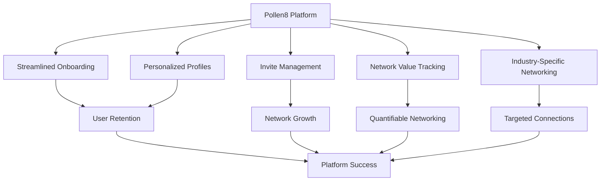
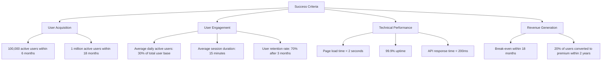
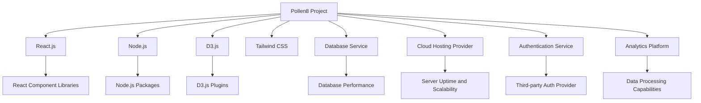
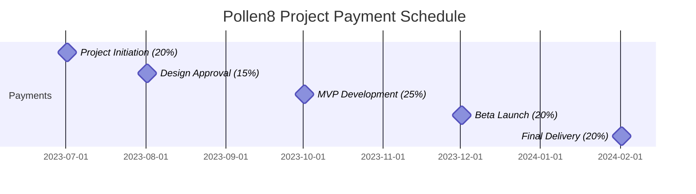
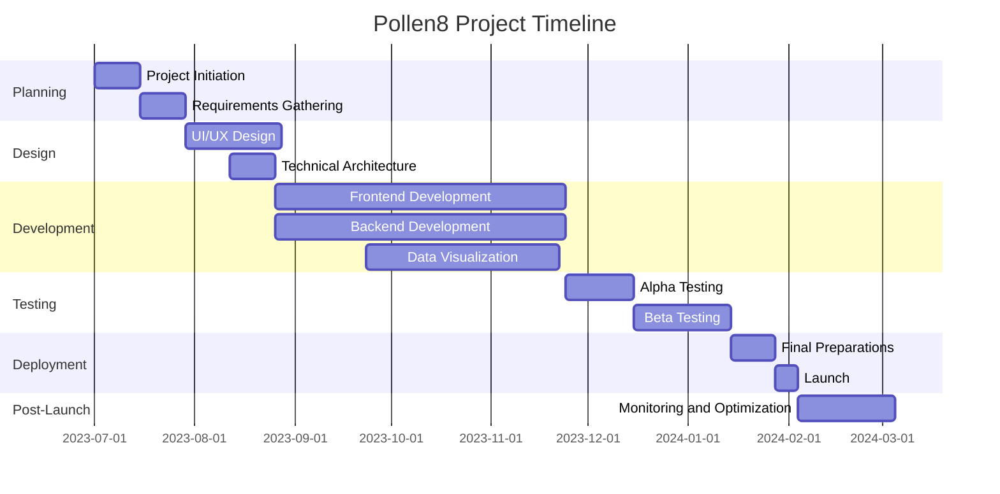
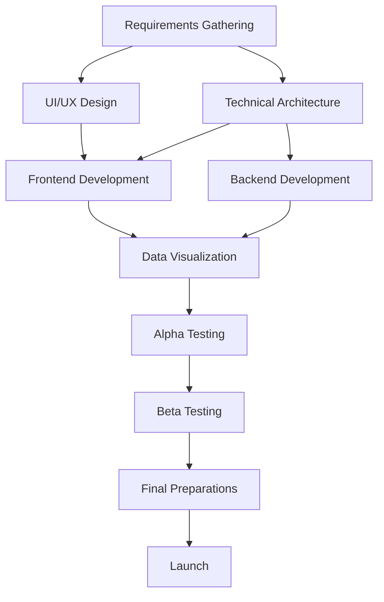
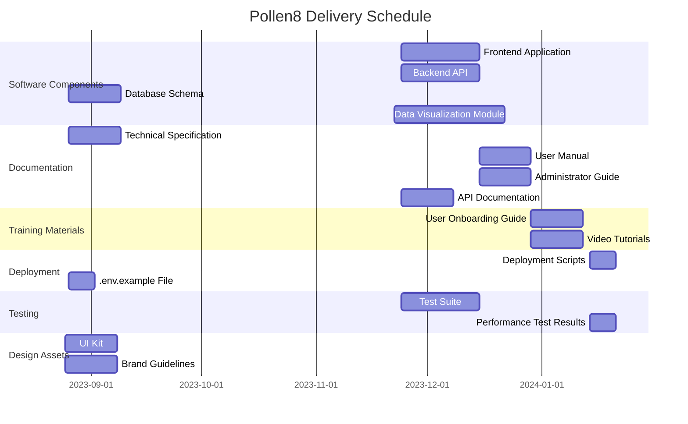

## EXECUTIVE SUMMARY

### PROJECT OVERVIEW

Pollen8 is a cutting-edge web platform designed to revolutionize professional networking and industry connections. The client, a forward-thinking startup, identified a gap in the market for a sleek, user-friendly networking tool that goes beyond traditional social media platforms. Pollen8 addresses this need by offering a minimalist, black-and-white interface that focuses on meaningful connections, industry-specific networking, and value-driven interactions.

The proposed solution comprises a multi-page web application built with React.js, Node.js, and D3.js, featuring:

1. Streamlined onboarding process
2. Personalized user profiles
3. Invite management system
4. Network value tracking
5. Industry-specific networking feeds

This platform will enable professionals to build and leverage their networks more effectively, quantify their networking efforts, and engage in targeted industry discussions.

### OBJECTIVES

1. Create a visually striking and user-friendly networking platform
2. Implement a seamless onboarding process for new users
3. Develop a robust invite system to facilitate network growth
4. Design an intuitive profile management interface
5. Integrate data visualization tools for network value and growth tracking
6. Enable industry-specific networking and discussions
7. Ensure responsive design for optimal user experience across devices

### VALUE PROPOSITION

Our agency brings unique value to this project through:

1. Expertise in modern web technologies (React.js, Node.js, D3.js)
2. Strong focus on user experience and interface design
3. Experience in developing data-driven applications
4. Ability to create visually appealing and functional black-and-white designs
5. Proficiency in implementing complex features like invite management and network value calculation
6. Track record of delivering responsive and performant web applications
7. Commitment to creating a platform that stands out in the crowded networking space

This value proposition ensures that Pollen8 will not only meet but exceed the client's expectations, delivering a unique and powerful networking tool that sets new standards in the industry.

## PROJECT OBJECTIVES

### BUSINESS GOALS

1. Increase user engagement and retention by providing a unique, value-driven networking experience
2. Establish Pollen8 as a leading platform for professional networking, targeting a 20% market share within two years
3. Generate revenue through premium features and targeted advertising, aiming for profitability within 18 months of launch
4. Enhance user productivity by facilitating meaningful connections and industry-specific discussions
5. Improve user satisfaction and platform stickiness, targeting a Net Promoter Score (NPS) of 50+ within the first year

### TECHNICAL GOALS

1. Develop a scalable and performant web application using React.js, Node.js, and D3.js
2. Implement a responsive design that provides a seamless experience across desktop and mobile devices
3. Create a robust and secure invite management system to facilitate controlled network growth
4. Develop an advanced algorithm for calculating and visualizing network value
5. Integrate real-time data processing for instant updates to user profiles and network feeds
6. Implement efficient data storage and retrieval mechanisms to handle large volumes of user data and interactions
7. Ensure platform security through encryption, secure authentication, and regular security audits

### SUCCESS CRITERIA

| Metric | Target | Timeframe |
|--------|--------|-----------|
| User Growth Rate | 15% month-over-month | First 12 months |
| Network Value Increase | 25% average per user | Per quarter |
| Industry Network Creation | 50 new networks | Per month |
| Invite Conversion Rate | 40% | Ongoing |
| Mobile Usage | 60% of total traffic | Within 6 months |
| Customer Support Satisfaction | 90% positive feedback | Ongoing |
| Platform Security | Zero critical vulnerabilities | Ongoing |
| Code Quality | 90% test coverage | Ongoing |

These success criteria will be regularly monitored and evaluated to ensure the project is on track to meet its objectives and deliver value to both users and stakeholders.

## SCOPE OF WORK

### IN-SCOPE

The following tasks, features, and functionalities are included in the Pollen8 project:

1. User Interface Development
   - Implement a black-and-white, minimalist design across all pages
   - Develop responsive layouts for desktop and mobile devices
   - Create smooth animations and transitions for enhanced user experience

2. User Authentication and Onboarding
   - Implement phone number-based user authentication
   - Develop a multi-step onboarding process including industry selection, interests, and location

3. Profile Management
   - Create user profile pages with customizable information
   - Implement profile banner with avatar and metadata grid

4. Invite Management System
   - Develop a system for generating and managing invite links
   - Create an interface for tracking invite link performance
   - Implement copy-to-clipboard functionality for invite links

5. Network Value Calculation and Visualization
   - Develop an algorithm for calculating network value based on connections
   - Create interactive visualizations using D3.js for network growth and value

6. Industry-Specific Networking
   - Implement industry selection and management features
   - Develop industry-specific networking feeds and discussions

7. Backend Development
   - Create a Node.js server to handle API requests and data management
   - Implement database integration for user data, invites, and network information

8. Data Visualization
   - Develop interactive graphs and charts using D3.js for network analytics
   - Create responsive and dynamic data visualizations for user engagement

9. Security Implementation
   - Implement secure authentication mechanisms
   - Ensure data encryption for sensitive user information
   - Conduct regular security audits and implement best practices

10. Performance Optimization
    - Optimize page load times and API response times
    - Implement efficient data storage and retrieval mechanisms

11. Testing and Quality Assurance
    - Conduct thorough testing of all features and functionalities
    - Perform cross-browser and cross-device compatibility testing
    - Achieve 90% test coverage for the codebase

### OUT-OF-SCOPE

The following items are explicitly excluded from the project scope:

1. Development of native mobile applications (iOS/Android)
2. Integration with external social media platforms
3. Implementation of a messaging or chat system within the platform
4. Creation of content or moderation tools for user-generated content
5. Development of a custom CMS for platform management
6. Implementation of e-commerce or payment processing features
7. Creation of a public API for third-party integrations
8. Development of offline functionality or PWA features
9. Implementation of advanced AI or machine learning algorithms for user matching
10. Creation of a dedicated mobile app for invite management

### ASSUMPTIONS

The project plan is based on the following assumptions:

1. The client will provide timely feedback and approvals at key project milestones
2. The client has secured all necessary rights and permissions for using the "Pollen8" name and branding
3. The client will provide access to any required third-party services or APIs needed for the project
4. The development team has access to necessary development tools and environments
5. The client will provide sample data for testing and development purposes
6. The client has a clear understanding of data privacy regulations and requirements
7. The project timeline assumes normal working conditions without major disruptions

### DEPENDENCIES

The following dependencies may impact the project timeline or deliverables:

| Dependency | Impact | Mitigation Strategy |
|------------|--------|---------------------|
| React.js and associated libraries | Core functionality of the frontend | Regular updates and compatibility checks |
| Node.js and required packages | Backend server functionality | Version control and thorough testing of package updates |
| D3.js and visualization libraries | Data visualization features | Extensive testing of visualizations across devices |
| Database service performance | Data storage and retrieval speed | Regular performance monitoring and optimization |
| Cloud hosting provider reliability | Platform uptime and scalability | Selection of a reputable provider with SLAs |
| Third-party authentication service | User login and security | Backup authentication methods and provider reliability checks |
| Analytics platform capabilities | User behavior tracking and reporting | Selection of a scalable analytics solution |

These dependencies will be closely monitored throughout the project lifecycle to ensure timely identification and resolution of any potential issues that may arise.

## BUDGET AND COST ESTIMATES

### COST BREAKDOWN

The following table provides a detailed breakdown of the project costs for the Pollen8 platform development:

| Category | Item | Cost (USD) |
|----------|------|------------|
| Labor | Frontend Development (React.js, D3.js) | $60,000 |
| Labor | Backend Development (Node.js) | $50,000 |
| Labor | UI/UX Design | $30,000 |
| Labor | Project Management | $25,000 |
| Labor | Quality Assurance and Testing | $20,000 |
| Software | Development Tools and Licenses | $5,000 |
| Infrastructure | Cloud Hosting and Services (1 year) | $12,000 |
| Infrastructure | Database Services (1 year) | $6,000 |
| Third-party Services | Authentication Service (1 year) | $3,000 |
| Third-party Services | Analytics Platform (1 year) | $4,000 |
| Miscellaneous | Contingency (10% of total) | $21,500 |
| **Total** | | **$236,500** |

### PAYMENT SCHEDULE

The proposed payment schedule is tied to project milestones and deliverables:

| Milestone | Percentage | Amount (USD) | Deliverables |
|-----------|------------|--------------|--------------|
| Project Initiation | 20% | $47,300 | Project kickoff, requirements finalization |
| Design Approval | 15% | $35,475 | Approved UI/UX designs, technical architecture |
| MVP Development | 25% | $59,125 | Core functionality implemented, initial testing |
| Beta Launch | 20% | $47,300 | Feature-complete beta version, user testing |
| Final Delivery | 20% | $47,300 | Fully tested platform, documentation, training |

### BUDGET CONSIDERATIONS

Several factors could impact the budget and require careful management:

1. Scope Creep: 
   - Risk: Additional features or changes in requirements may increase development time and costs.
   - Mitigation: Implement a strict change control process and clearly define the project scope in the contract.

2. Technology Challenges:
   - Risk: Unforeseen technical difficulties, especially in integrating D3.js visualizations or optimizing performance.
   - Mitigation: Allocate additional time for research and prototyping in complex areas. Consider bringing in specialized consultants if needed.

3. Third-party Service Costs:
   - Risk: Prices for cloud hosting, authentication, or analytics services may increase.
   - Mitigation: Lock in rates with service providers where possible. Include clauses in the contract to address potential price increases.

4. Scalability Requirements:
   - Risk: Rapid user growth may require additional infrastructure investments.
   - Mitigation: Design the architecture for scalability from the start. Include provisions for scaling costs in the contract.

5. Security and Compliance:
   - Risk: Evolving data protection regulations may require additional security measures.
   - Mitigation: Stay informed about regulatory changes. Budget for regular security audits and updates.

6. Team Availability:
   - Risk: Key team members may become unavailable, requiring replacement or causing delays.
   - Mitigation: Cross-train team members and maintain detailed documentation to facilitate knowledge transfer.

7. Client Feedback Cycles:
   - Risk: Delayed client feedback may extend the project timeline and increase costs.
   - Mitigation: Clearly define feedback timelines in the contract. Implement agile methodologies to accommodate iterative feedback.

To manage these considerations:

- Maintain open communication with the client about potential budget impacts.
- Conduct regular risk assessments and adjust the project plan as needed.
- Use the contingency budget judiciously to address unforeseen challenges.
- Implement a change request process that includes budget impact assessments for any scope changes.

By proactively addressing these budget considerations, we can minimize financial risks and ensure the successful delivery of the Pollen8 platform within the proposed budget framework.

## TIMELINE AND MILESTONES

### PROJECT TIMELINE

### KEY MILESTONES

| Milestone | Description | Target Date |
|-----------|-------------|-------------|
| M1: Project Kickoff | Project initiation and team onboarding | 2023-07-01 |
| M2: Design Approval | Finalization of UI/UX designs and technical architecture | 2023-08-25 |
| M3: MVP Development | Core functionality implemented and ready for testing | 2023-11-23 |
| M4: Beta Launch | Feature-complete version ready for user testing | 2023-12-15 |
| M5: Platform Launch | Official release of Pollen8 platform | 2024-01-28 |
| M6: Post-Launch Review | Evaluation of platform performance and user feedback | 2024-03-05 |

### CRITICAL PATH

The following tasks represent the critical path for the Pollen8 project:

1. Requirements Gathering (14 days)
2. UI/UX Design (30 days)
3. Technical Architecture Design (14 days)
4. Frontend and Backend Development (90 days)
5. Data Visualization Implementation (60 days)
6. Alpha Testing (21 days)
7. Beta Testing (30 days)
8. Final Preparations (14 days)
9. Launch (7 days)

To ensure the project stays on schedule, special attention should be given to:

1. Timely completion of the UI/UX design phase, as it directly impacts frontend development.
2. Parallel development of frontend and backend components to maximize efficiency.
3. Early integration of data visualization features to allow for thorough testing and refinement.
4. Efficient management of the testing phases to identify and resolve issues quickly.
5. Smooth coordination between development, testing, and deployment teams during the final stages.

Regular progress reviews and risk assessments should be conducted throughout the project lifecycle to identify and address any potential delays in these critical path activities.

## DELIVERABLES

### LIST OF DELIVERABLES

The following table provides a comprehensive list of deliverables for the Pollen8 project:

| Category | Deliverable | Description |
|----------|-------------|-------------|
| Software Components | Frontend Application | React.js-based web application with responsive design |
| Software Components | Backend API | Node.js server with RESTful API endpoints |
| Software Components | Database Schema | Optimized database structure for user data and interactions |
| Software Components | Data Visualization Module | D3.js-based interactive charts and graphs |
| Documentation | Technical Specification | Detailed documentation of system architecture and APIs |
| Documentation | User Manual | Comprehensive guide for end-users on platform features |
| Documentation | Administrator Guide | Instructions for platform management and maintenance |
| Documentation | API Documentation | Detailed documentation of all API endpoints and usage |
| Training Materials | User Onboarding Guide | Step-by-step guide for new user registration and setup |
| Training Materials | Video Tutorials | Series of short instructional videos on key platform features |
| Deployment | Deployment Scripts | Automated scripts for application deployment |
| Deployment | .env.example File | Template for environment variables configuration |
| Testing | Test Suite | Comprehensive set of unit and integration tests |
| Testing | Performance Test Results | Report on load testing and performance benchmarks |
| Design Assets | UI Kit | Reusable UI components and design guidelines |
| Design Assets | Brand Guidelines | Document outlining logo usage, color palette, and typography |

### DELIVERY SCHEDULE

### ACCEPTANCE CRITERIA

The following table outlines the acceptance criteria for each major deliverable:

| Deliverable | Acceptance Criteria |
|-------------|---------------------|
| Frontend Application | - Implements all specified features and pages - Responsive design works on desktop and mobile devices - Achieves 90% or higher score on Lighthouse performance audit - Passes all unit and integration tests - Complies with agreed-upon UI/UX design specifications |
| Backend API | - Implements all required endpoints with correct functionality - Handles expected load with response times under 200ms - Properly authenticates and authorizes users - Passes all unit and integration tests - Adheres to RESTful API design principles |
| Database Schema | - Efficiently stores all required data types - Supports all necessary queries with optimal performance - Includes appropriate indexes and constraints - Can be easily migrated and scaled |
| Data Visualization Module | - Accurately represents data from the backend - Interactive elements respond within 100ms - Visualizations are responsive and render correctly on all supported devices - Accessibility features are implemented for all charts and graphs |
| Technical Documentation | - Covers all major components and subsystems - Includes clear diagrams and explanations of system architecture - Provides accurate and up-to-date API documentation - Follows agreed-upon documentation standards |
| User Manual & Training Materials | - Covers all user-facing features and functionalities - Includes clear, step-by-step instructions with screenshots - Video tutorials are clear, concise, and cover all key user workflows - Materials are reviewed and approved by the client |
| Deployment Scripts | - Successfully deploy the application to the specified environment - Include rollback procedures in case of deployment issues - Are well-documented and can be run by the client's IT team |
| .env.example File | - Includes all necessary environment variables - Provides clear descriptions and example values for each variable - Does not contain any sensitive information or actual production values |
| Test Suite | - Achieves at least 90% code coverage - Includes unit tests for all major components - Includes integration tests for critical user workflows - Can be easily run in CI/CD pipeline |
| Performance Test Results | - Demonstrates the application can handle the specified user load - Shows response times within agreed-upon thresholds - Identifies any performance bottlenecks and provides recommendations |
| UI Kit & Brand Guidelines | - Includes all necessary UI components used in the application - Provides clear usage guidelines for each component - Accurately represents the agreed-upon brand identity - Includes downloadable assets in appropriate formats |

Each deliverable will be reviewed against these criteria before being considered complete. The client will have a 5-business-day review period for each deliverable, during which they can request revisions or clarifications. Final acceptance of each deliverable will require written approval from the designated client representative.