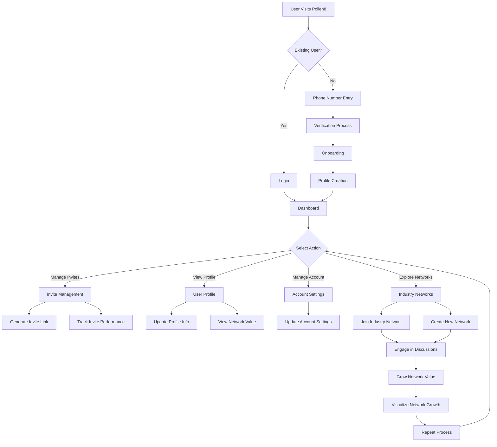
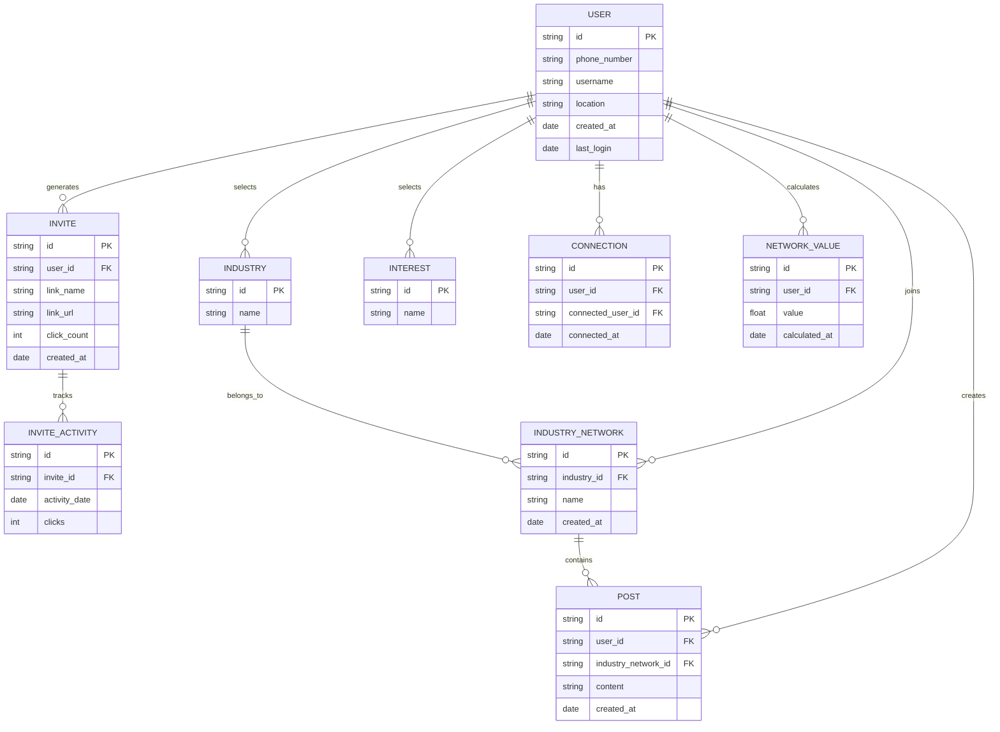
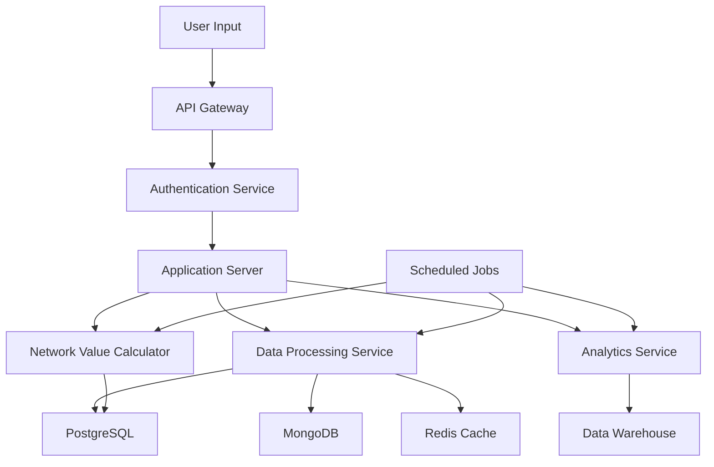

# 1. INTRODUCTION

## 1.1 PURPOSE

The purpose of this Software Requirements Specification (SRS) document is to provide a comprehensive and detailed description of the Pollen8 networking platform. This document serves as the primary reference for the development team, project stakeholders, and quality assurance personnel. It outlines the functional and non-functional requirements, system architecture, and design constraints for the Pollen8 platform.

The intended audience for this SRS includes:

1. Development team members (frontend and backend developers, UI/UX designers)
2. Project managers and team leads
3. Quality assurance and testing personnel
4. Client representatives and stakeholders
5. System administrators and maintenance staff

This document aims to ensure a shared understanding of the project goals, reduce miscommunication, and serve as a basis for project planning, cost estimation, and acceptance criteria.

## 1.2 SCOPE

Pollen8 is a cutting-edge web-based networking platform designed to revolutionize professional connections and industry-specific networking. The platform aims to provide a unique, value-driven experience that goes beyond traditional social media platforms.

### Goals:

1. Create a visually striking and user-friendly networking platform
2. Facilitate meaningful professional connections across various industries
3. Provide users with quantifiable metrics for their networking efforts
4. Enable targeted, industry-specific discussions and interactions
5. Offer a seamless and engaging user experience across devices

### Benefits:

1. Enhanced professional networking opportunities for users
2. Increased visibility and value of users' professional networks
3. Improved industry-specific knowledge sharing and collaboration
4. Streamlined invite management for controlled network growth
5. Data-driven insights into networking effectiveness and industry trends

### Core Functionalities:

1. User authentication and profile management
2. Personalized onboarding process
3. Invite generation and management system
4. Network value calculation and visualization
5. Industry-specific networking feeds and discussions
6. Interactive data visualizations for network analytics
7. Responsive design for cross-device compatibility

The Pollen8 platform will be developed using modern web technologies, including:

- Frontend: React.js for the user interface, with Tailwind CSS for styling
- Backend: Node.js for server-side functionality
- Data Visualization: D3.js for interactive charts and graphs
- Database: To be determined based on data storage requirements
- Authentication: Secure phone number-based authentication system

The platform will feature a distinctive black-and-white aesthetic with a minimalist, clean, and modern UI. User interaction will be enhanced through smooth animations, precise form inputs, and responsive behavior across desktop and mobile devices.

By focusing on these core functionalities and leveraging cutting-edge technologies, Pollen8 aims to establish itself as a leading platform in the professional networking space, offering unique value to its users and setting new standards for industry-specific networking tools.

# 2. PRODUCT DESCRIPTION

## 2.1 PRODUCT PERSPECTIVE

Pollen8 is a standalone web-based networking platform designed to revolutionize professional connections and industry-specific networking. While it operates independently, it exists within the broader ecosystem of professional networking and social media platforms. The key differentiators of Pollen8 are:

1. Focus on industry-specific networking
2. Quantifiable network value metrics
3. Controlled network growth through invite management
4. Minimalist, black-and-white aesthetic

Pollen8 integrates with the following external systems:

- Cloud hosting services for scalable deployment
- Third-party authentication services for secure user verification
- Analytics platforms for user behavior tracking and reporting

The platform is built using a modern web technology stack:

- Frontend: React.js with Tailwind CSS for styling
- Backend: Node.js for server-side functionality
- Data Visualization: D3.js for interactive charts and graphs
- Database: To be determined based on data storage requirements

This architecture ensures a responsive, scalable, and maintainable solution that can evolve with user needs and technological advancements.

## 2.2 PRODUCT FUNCTIONS

Pollen8 offers the following core functions:

1. User Authentication and Profile Management
   - Phone number-based secure authentication
   - Customizable user profiles with industry and interest selection
   - Profile metadata display including industries, interests, and location

2. Personalized Onboarding
   - Multi-step onboarding process for new users
   - Industry, interest, and location selection

3. Invite Generation and Management
   - Creation and tracking of personalized invite links
   - Performance metrics for invite links (e.g., click counts)
   - Invite link activity visualization

4. Network Value Calculation and Visualization
   - Algorithm-based calculation of user's network value
   - Interactive visualizations of network growth and value over time

5. Industry-Specific Networking Feeds
   - Customized content feeds based on user's industry selections
   - Creation and management of industry-specific networks

6. Data Visualization and Analytics
   - Interactive charts and graphs for network analytics
   - User-friendly representations of complex networking data

7. Responsive Design
   - Seamless user experience across desktop and mobile devices
   - Optimized layouts for various screen sizes

## 2.3 USER CHARACTERISTICS

Pollen8 is designed for a diverse range of professionals seeking to build and leverage their industry networks. The primary user groups include:

1. Young Professionals
   - Age: 22-35
   - Tech-savvy and comfortable with digital platforms
   - Seeking to build their professional network and industry connections
   - Persona: Alex, 28, Marketing Specialist, looking to expand their network in the tech industry

2. Mid-Career Professionals
   - Age: 35-50
   - Experienced in their field with established networks
   - Interested in quantifying and expanding their professional connections
   - Persona: Sarah, 42, Sales Director, wants to leverage her network for new business opportunities

3. Industry Leaders and Executives
   - Age: 45+
   - Extensive professional experience and large existing networks
   - Seeking targeted, high-value connections within specific industries
   - Persona: Michael, 52, CEO of a startup, looking to connect with potential investors and partners

4. Entrepreneurs and Freelancers
   - Age: Various
   - Highly motivated to build diverse networks across multiple industries
   - Interested in measuring the value and growth of their professional connections
   - Persona: Emma, 31, Freelance Designer, wants to expand her client base through strategic networking

All users are expected to have basic digital literacy and familiarity with social networking concepts. The platform's intuitive design caters to users with varying levels of technical expertise, from tech-savvy millennials to less tech-oriented senior professionals.

## 2.4 CONSTRAINTS

1. Technical Constraints
   - Must be compatible with modern web browsers (Chrome, Firefox, Safari, Edge)
   - Mobile responsiveness is required for screens as small as 320px wide
   - Backend must handle concurrent users and maintain response times under 200ms

2. Regulatory Constraints
   - Must comply with GDPR and other relevant data protection regulations
   - User data must be encrypted and securely stored
   - Clear consent mechanisms for data collection and usage

3. Business Constraints
   - Initial launch limited to English language support
   - MVP features must be delivered within the specified 7-month timeline
   - Project budget capped at $236,500 as outlined in the budget section

4. Design Constraints
   - Strict adherence to the black-and-white, minimalist aesthetic
   - UI components must follow the specified design system and style guide
   - Accessibility standards (WCAG 2.1 AA) must be met

5. Performance Constraints
   - Page load times must not exceed 2 seconds on average
   - Data visualizations must render and update within 100ms
   - Platform must support up to 100,000 active users in the first 6 months

6. Security Constraints
   - Implementation of secure authentication mechanisms
   - Regular security audits and penetration testing required
   - Compliance with industry-standard security protocols (e.g., OWASP guidelines)

## 2.5 ASSUMPTIONS AND DEPENDENCIES

### Assumptions

1. Users have access to modern web browsers and stable internet connections
2. The target audience is familiar with basic social networking concepts
3. The black-and-white aesthetic will be appealing to the target user base
4. The invite-based system will lead to controlled, high-quality network growth
5. Users are willing to provide their phone numbers for authentication
6. The platform will not require integration with existing social media platforms for MVP

### Dependencies

1. Availability and reliability of the chosen cloud hosting provider
2. Continued support and updates for key technologies (React.js, Node.js, D3.js)
3. Timely delivery of design assets and final approval of UI/UX designs
4. Availability of third-party services for authentication and analytics
5. Stability of the chosen database solution for storing user and network data
6. Compliance of third-party libraries and components with project licensing requirements
7. Availability of test users for beta testing and feedback collection
8. Timely client feedback and approvals at key project milestones

By clearly defining these assumptions and dependencies, the development team can better manage risks and ensure the successful delivery of the Pollen8 platform within the specified constraints and timelines.

Here's the PROCESS FLOWCHART section for the Pollen8 SRS using Mermaid JS, maintaining consistency with the previously mentioned technologies and frameworks:

## PROCESS FLOWCHART

The following flowchart illustrates the main user journey and key processes within the Pollen8 platform:

This flowchart outlines the primary user interactions within the Pollen8 platform, from initial login or registration through to the core functionalities of managing invites, viewing profiles, and engaging in industry networks. Key points in the process include:

1. User Authentication: Differentiating between new and existing users, with a phone number-based verification process for new users.
2. Onboarding: Guiding new users through profile creation and initial setup.
3. Dashboard: The central hub from which users can access various platform features.
4. Invite Management: Allowing users to generate and track invite links.
5. Profile and Account Management: Enabling users to update their information and settings.
6. Industry Networks: Facilitating the joining or creation of industry-specific networks.
7. Engagement and Growth: Encouraging user participation in discussions to grow their network value.
8. Visualization: Providing users with visual representations of their network growth using D3.js.

This process flow is designed to align with the React.js frontend, Node.js backend, and D3.js data visualization components previously specified in the SRS. It emphasizes the platform's focus on user engagement, network growth, and value visualization, all within the context of the minimalist, black-and-white aesthetic described earlier in the document.

Here's a breakdown of the Pollen8 product into features, maintaining consistency with the previously mentioned technologies and frameworks:

1. User Authentication and Profile Management

ID: F001
DESCRIPTION: Secure phone number-based authentication system and user profile management.
PRIORITY: High

| Requirement ID | Requirement Description |
|----------------|--------------------------|
| F001-1 | Implement phone number verification for user registration |
| F001-2 | Create and edit user profiles with industry, interests, and location |
| F001-3 | Display user profile with metadata grid (industries, interests, location) |
| F001-4 | Implement secure login/logout functionality |
| F001-5 | Allow users to update their profile information |

2. Personalized Onboarding Process

ID: F002
DESCRIPTION: Multi-step onboarding process for new users to set up their profile and preferences.
PRIORITY: High

| Requirement ID | Requirement Description |
|----------------|--------------------------|
| F002-1 | Implement a welcome screen with animated "POLLEN8" text |
| F002-2 | Create a multi-step form for industry, interest, and location selection |
| F002-3 | Validate user inputs and provide feedback during onboarding |
| F002-4 | Store onboarding information in the user's profile |
| F002-5 | Allow users to skip or complete onboarding later |

3. Invite Management System

ID: F003
DESCRIPTION: System for generating, tracking, and managing invite links.
PRIORITY: High

| Requirement ID | Requirement Description |
|----------------|--------------------------|
| F003-1 | Generate unique invite links for users |
| F003-2 | Track invite link performance (clicks, conversions) |
| F003-3 | Display invite list with link name, URL, and click count |
| F003-4 | Implement one-click copy functionality for invite links |
| F003-5 | Show 30-day activity graph for each invite link using D3.js |

4. Network Value Calculation and Visualization

ID: F004
DESCRIPTION: Algorithm-based calculation of user's network value and interactive visualizations.
PRIORITY: Medium

| Requirement ID | Requirement Description |
|----------------|--------------------------|
| F004-1 | Develop algorithm to calculate network value based on connections |
| F004-2 | Create interactive network growth visualization using D3.js |
| F004-3 | Display network value on user profile and dashboard |
| F004-4 | Update network value in real-time as connections change |
| F004-5 | Provide detailed breakdown of network value components |

5. Industry-Specific Networking Feeds

ID: F005
DESCRIPTION: Customized content feeds and networking opportunities based on user's industry selections.
PRIORITY: Medium

| Requirement ID | Requirement Description |
|----------------|--------------------------|
| F005-1 | Generate personalized feed based on user's selected industries |
| F005-2 | Allow users to join or create industry-specific networks |
| F005-3 | Implement posting and interaction features within industry networks |
| F005-4 | Provide discovery mechanism for new industry networks |
| F005-5 | Allow users to manage their industry network memberships |

6. Data Visualization and Analytics

ID: F006
DESCRIPTION: Interactive charts and graphs for network analytics and user engagement.
PRIORITY: Medium

| Requirement ID | Requirement Description |
|----------------|--------------------------|
| F006-1 | Create interactive network growth chart using D3.js |
| F006-2 | Implement user engagement analytics dashboard |
| F006-3 | Visualize invite link performance with interactive graphs |
| F006-4 | Provide industry breakdown visualization of user's network |
| F006-5 | Generate exportable reports of user's networking metrics |

7. Responsive Design

ID: F007
DESCRIPTION: Seamless user experience across desktop and mobile devices with a black-and-white aesthetic.
PRIORITY: High

| Requirement ID | Requirement Description |
|----------------|--------------------------|
| F007-1 | Implement responsive layouts using React.js and Tailwind CSS |
| F007-2 | Ensure all features are fully functional on mobile devices |
| F007-3 | Optimize performance for various screen sizes and resolutions |
| F007-4 | Maintain consistent black-and-white aesthetic across all views |
| F007-5 | Implement smooth animations and transitions for enhanced UX |

8. Account Management

ID: F008
DESCRIPTION: Features for users to manage their account settings and preferences.
PRIORITY: Medium

| Requirement ID | Requirement Description |
|----------------|--------------------------|
| F008-1 | Allow users to update their phone number and verify changes |
| F008-2 | Implement privacy settings for profile visibility |
| F008-3 | Provide option to deactivate or delete account |
| F008-4 | Allow users to manage notification preferences |
| F008-5 | Implement two-factor authentication (2FA) option |

9. Search and Discovery

ID: F009
DESCRIPTION: Features to help users find and connect with relevant professionals and networks.
PRIORITY: Low

| Requirement ID | Requirement Description |
|----------------|--------------------------|
| F009-1 | Implement search functionality for users and industry networks |
| F009-2 | Provide filters for search results (industry, location, etc.) |
| F009-3 | Suggest relevant connections based on user's profile |
| F009-4 | Allow users to browse popular or trending industry networks |
| F009-5 | Implement tagging system for easier discovery of content and users |

10. Performance Optimization

ID: F010
DESCRIPTION: Ensure the platform is fast, responsive, and can handle a growing user base.
PRIORITY: High

| Requirement ID | Requirement Description |
|----------------|--------------------------|
| F010-1 | Optimize React.js components for efficient rendering |
| F010-2 | Implement server-side rendering for improved initial load times |
| F010-3 | Optimize database queries for faster data retrieval |
| F010-4 | Implement caching mechanisms for frequently accessed data |
| F010-5 | Ensure all API endpoints respond within 200ms under normal load |

These features align with the previously specified technologies (React.js, Node.js, D3.js, Tailwind CSS) and maintain the focus on a black-and-white aesthetic with a minimalist, clean, and modern UI. The priorities are assigned based on the core functionality of the Pollen8 platform and the value they provide to users.

# 3. NON-FUNCTIONAL REQUIREMENTS

## 3.1 PERFORMANCE

1. Response Time:
   - Web pages must load within 2 seconds on desktop devices and 3 seconds on mobile devices.
   - API endpoints must respond within 200ms under normal load conditions.
   - Data visualizations using D3.js must render and update within 100ms.

2. Throughput:
   - The system must support at least 1000 concurrent users without degradation in performance.
   - The platform should handle up to 100 API requests per second.

3. Resource Usage:
   - Client-side application should not exceed 5MB in size (excluding assets).
   - Server CPU utilization should not exceed 70% under normal load.
   - Database queries should complete within 50ms for 95% of requests.

## 3.2 SAFETY

1. Data Backup:
   - Automated daily backups of all user data and system configurations.
   - Ability to restore from backups within 4 hours in case of data loss.

2. Fault Tolerance:
   - Implement redundancy for critical system components to ensure 99.9% uptime.
   - Graceful degradation of non-critical features during partial system failures.

3. Error Handling:
   - Comprehensive error logging and monitoring system.
   - User-friendly error messages that do not expose sensitive system information.

## 3.3 SECURITY

1. Authentication:
   - Implement secure phone number-based authentication.
   - Support two-factor authentication (2FA) for enhanced account security.

2. Authorization:
   - Role-based access control (RBAC) for different user types (e.g., regular users, administrators).
   - Implement principle of least privilege for all system operations.

3. Data Encryption:
   - Use HTTPS/TLS for all data transmissions.
   - Encrypt sensitive data at rest using industry-standard encryption algorithms (e.g., AES-256).

4. Privacy:
   - Implement data anonymization techniques for analytics and reporting.
   - Provide users with granular control over their data sharing preferences.

5. Security Auditing:
   - Conduct regular security audits and penetration testing.
   - Implement a bug bounty program to encourage responsible disclosure of security vulnerabilities.

## 3.4 QUALITY

1. Availability:
   - Achieve 99.9% uptime for the platform, excluding scheduled maintenance.
   - Implement automated health checks and self-healing mechanisms for critical services.

2. Maintainability:
   - Adhere to clean code principles and consistent coding standards across the codebase.
   - Maintain comprehensive documentation for all system components and APIs.
   - Achieve a minimum of 90% test coverage for both frontend and backend code.

3. Usability:
   - Achieve a System Usability Scale (SUS) score of at least 80.
   - Ensure the platform is accessible and compliant with WCAG 2.1 Level AA standards.
   - Support the latest two versions of major browsers (Chrome, Firefox, Safari, Edge).

4. Scalability:
   - Design the system architecture to support horizontal scaling.
   - Implement database sharding to handle increased data volume.
   - Use content delivery networks (CDNs) for efficient delivery of static assets.

5. Reliability:
   - Achieve a Mean Time Between Failures (MTBF) of at least 720 hours.
   - Implement automated monitoring and alerting for system health and performance metrics.
   - Conduct regular disaster recovery drills to ensure business continuity.

## 3.5 COMPLIANCE

1. Legal:
   - Comply with all applicable data protection laws, including GDPR and CCPA.
   - Implement necessary measures to adhere to local data residency requirements.

2. Regulatory:
   - Obtain and maintain necessary certifications for handling user data (e.g., ISO 27001).
   - Implement age verification mechanisms to comply with age-restricted content regulations.

3. Standards:
   - Adhere to OAuth 2.0 standards for authentication and authorization.
   - Follow REST API design principles for all backend services.
   - Comply with W3C standards for web accessibility (WCAG 2.1 Level AA).

4. Industry Best Practices:
   - Implement OWASP Top 10 security controls to mitigate common web application vulnerabilities.
   - Follow the Twelve-Factor App methodology for building scalable, maintainable web applications.

5. Reporting and Auditing:
   - Maintain detailed logs of all system activities for auditing purposes.
   - Provide mechanisms for generating compliance reports as required by regulatory bodies.

These non-functional requirements are designed to ensure that the Pollen8 platform is performant, secure, reliable, and compliant with relevant standards and regulations. They align with the previously specified technologies (React.js, Node.js, D3.js, Tailwind CSS) and maintain the focus on delivering a high-quality, user-centric networking platform.

# 4. DATA REQUIREMENTS

## 4.1 DATA MODELS

The Pollen8 platform requires a robust data model to support its various features and functionalities. The following entity-relationship diagram illustrates the key entities and their relationships:

This data model supports the core functionalities of Pollen8, including user profiles, invite management, industry networks, and network value calculation.

## 4.2 DATA STORAGE

To ensure efficient data storage, retrieval, and scalability, Pollen8 will utilize a combination of relational and NoSQL databases:

1. Primary Database: PostgreSQL
   - Stores structured data such as user profiles, invites, and connections
   - Provides ACID compliance for critical transactions
   - Supports complex queries and relationships between entities

2. Caching Layer: Redis
   - Caches frequently accessed data to reduce database load
   - Stores session information and temporary data
   - Improves response times for API requests

3. Document Store: MongoDB
   - Stores unstructured data such as user posts and activity logs
   - Provides flexibility for storing varying data structures
   - Scales horizontally to accommodate growing data volumes

### Data Retention

- User data: Retained indefinitely while the account is active
- Invite data: Retained for 1 year after the last activity
- Post data: Retained indefinitely
- Activity logs: Retained for 90 days

### Redundancy and Backup

1. Database Replication
   - PostgreSQL: Implement primary-secondary replication with automatic failover
   - MongoDB: Use replica sets with at least three nodes for high availability

2. Regular Backups
   - Daily full backups of all databases
   - Hourly incremental backups
   - Backups stored in a separate geographic region for disaster recovery

3. Point-in-Time Recovery
   - Enable continuous archiving and point-in-time recovery for PostgreSQL
   - Implement oplog tailing for MongoDB to allow point-in-time recovery

### Data Recovery

1. Automated Recovery Scripts
   - Develop and maintain scripts for automated database recovery
   - Regularly test recovery procedures to ensure effectiveness

2. Recovery Time Objective (RTO)
   - Set RTO to 1 hour for critical data
   - Implement monitoring and alerting systems to quickly identify and respond to issues

3. Recovery Point Objective (RPO)
   - Set RPO to 5 minutes for critical data
   - Utilize transaction logs and oplog tailing to minimize data loss

## 4.3 DATA PROCESSING

Pollen8's data processing pipeline ensures efficient handling of user data, network calculations, and analytics. The following data flow diagram illustrates the key components and data flows within the system:

### Data Security

To ensure the security and privacy of user data, Pollen8 implements the following measures:

1. Encryption
   - All data in transit is encrypted using TLS 1.3
   - Sensitive data at rest is encrypted using AES-256

2. Access Control
   - Implement role-based access control (RBAC) for all system components
   - Use principle of least privilege for service accounts and API access

3. Data Anonymization
   - Anonymize personal data used for analytics and reporting
   - Implement data masking for sensitive fields in non-production environments

4. Audit Logging
   - Maintain comprehensive audit logs for all data access and modifications
   - Store audit logs in a separate, immutable storage system

5. Data Processing Agreement
   - Establish clear data processing agreements with any third-party services
   - Ensure compliance with GDPR and other relevant data protection regulations

6. Regular Security Audits
   - Conduct quarterly security audits of data processing systems
   - Perform annual penetration testing on all data storage and processing components

7. Secure Development Practices
   - Implement secure coding practices and regular code reviews
   - Use automated vulnerability scanning in the CI/CD pipeline

By implementing these data requirements, Pollen8 ensures efficient, secure, and scalable data management that aligns with the platform's goals and user expectations. The chosen technologies (PostgreSQL, Redis, MongoDB) complement the previously specified stack (React.js, Node.js, D3.js) and provide a robust foundation for the platform's data needs.

# 5. EXTERNAL INTERFACES

## 5.1 USER INTERFACES

The Pollen8 platform will feature a minimalist, black-and-white aesthetic with a clean and modern user interface. The UI will be developed using React.js for component-based architecture and Tailwind CSS for styling, ensuring consistency across all pages and responsive design for various screen sizes.

Key user interface requirements include:

1. Responsive design for seamless experience across desktop and mobile devices
2. Black background (#000000) with white (#FFFFFF) and light gray (#EFEFEF) text
3. Proxima Nova font family for all text elements
4. Smooth animations and transitions for enhanced user experience
5. Precise form inputs with clear visual feedback
6. Interactive data visualizations using D3.js

Placeholder for mockups:
[Insert mockups for key pages: Welcome, Onboarding, User Profile, Invite Management, and Account pages]

Specific UI components include:

1. Welcome Page:
   - Animated "POLLEN8" text
   - "GET CONNECTED" button with 50% left-side border radius
   - Phone number input field with centered placeholder

2. Onboarding Form:
   - Stacked form layout with industry, interest, and ZIP code fields
   - Dropdown checkbox fields for industry and interest selection
   - "ONBOARD" button

3. User Profile Page:
   - Profile banner with pulsing white ring around avatar
   - Metadata grid displaying industries, interests, and location
   - Action buttons for managing invites and account

4. Invite Management Page:
   - Top banner with "INVITES" text and close button
   - List area with expandable rows for invite details
   - "GENERATE LINK" button and link creation interface

5. Account Page:
   - Header with pulsing orb and invite link generation icon
   - Profile banner with animated star constellation background
   - Buttons for Connections, Network Value, and Industry Networks
   - Dynamic network feed based on selected option

## 5.2 SOFTWARE INTERFACES

The Pollen8 platform will interact with various software components and third-party services. Key software interfaces include:

1. Backend API (Node.js):
   - RESTful API endpoints for all frontend-backend communications
   - JSON data format for request and response payloads
   - JWT-based authentication for secure API access

2. Database:
   - Interface with the chosen database system (to be determined)
   - ORM (Object-Relational Mapping) layer for efficient data access and manipulation

3. Authentication Service:
   - Integration with a third-party phone number-based authentication service
   - OAuth 2.0 protocol for secure token-based authentication

4. Analytics Platform:
   - API integration with a third-party analytics service
   - Event tracking for user actions and platform usage

5. Cloud Storage Service:
   - API integration for storing and retrieving user-generated content (e.g., profile pictures)
   - Secure access controls and encryption for stored data

6. Email Service Provider:
   - SMTP or API integration for sending transactional emails (e.g., invite notifications)

7. Content Delivery Network (CDN):
   - Integration for efficient delivery of static assets (images, CSS, JavaScript files)

## 5.3 COMMUNICATION INTERFACES

The Pollen8 platform will utilize various communication interfaces to ensure efficient data exchange and system interactions:

1. HTTP/HTTPS:
   - All client-server communications will use HTTPS protocol
   - TLS 1.3 encryption for secure data transmission

2. WebSocket:
   - Real-time updates for notifications and live data changes
   - Secure WebSocket (WSS) protocol for encrypted communications

3. RESTful API:
   - JSON data format for all API requests and responses
   - Standard HTTP methods (GET, POST, PUT, DELETE) for CRUD operations
   - Versioned API endpoints (e.g., /api/v1/) for future compatibility

4. Database Communication:
   - Secure TCP/IP connection to the database server
   - Prepared statements and parameterized queries to prevent SQL injection

5. Third-party API Integrations:
   - OAuth 2.0 for secure authentication with external services
   - API-specific protocols and data formats as required by each service

6. Mobile Deep Linking:
   - Implementation of deep linking protocols for seamless mobile app integration (future feature)

7. Push Notifications:
   - Integration with platform-specific push notification services (iOS, Android, web) for future mobile app support

8. Rate Limiting:
   - Implementation of rate limiting on API endpoints to prevent abuse and ensure fair usage

9. CORS (Cross-Origin Resource Sharing):
   - Proper CORS configuration to allow secure cross-origin requests from approved domains

10. Caching:
    - Implementation of caching mechanisms (e.g., Redis) for improved performance and reduced server load

These communication interfaces will be implemented using industry-standard protocols and best practices to ensure security, efficiency, and scalability of the Pollen8 platform.

# APPENDICES

## GLOSSARY

- **Network Value**: A quantitative measure of a user's professional network, calculated based on the number and quality of connections within the Pollen8 platform.
- **Industry Network**: A group of users within Pollen8 who share a common professional industry or field of interest.
- **Invite Link**: A unique URL generated by users to invite others to join their network on Pollen8.
- **Onboarding**: The process of guiding new users through account creation and initial setup on the Pollen8 platform.
- **Metadata Grid**: A visual representation of a user's profile information, including industries, interests, and location.
- **Invite Management**: The system for creating, tracking, and analyzing the performance of invite links.
- **Network Feed**: A customized stream of updates and content based on a user's connections and industry networks.
- **Network Analytics**: Visual representations and data insights about a user's network growth and value over time.

## ACRONYMS

- **API**: Application Programming Interface
- **CRUD**: Create, Read, Update, Delete
- **CSS**: Cascading Style Sheets
- **D3.js**: Data-Driven Documents JavaScript library
- **GDPR**: General Data Protection Regulation
- **HTML**: Hypertext Markup Language
- **HTTP**: Hypertext Transfer Protocol
- **HTTPS**: Hypertext Transfer Protocol Secure
- **JSON**: JavaScript Object Notation
- **JWT**: JSON Web Token
- **MVP**: Minimum Viable Product
- **NPS**: Net Promoter Score
- **ORM**: Object-Relational Mapping
- **REST**: Representational State Transfer
- **SPA**: Single Page Application
- **SQL**: Structured Query Language
- **SRS**: Software Requirements Specification
- **SSL**: Secure Sockets Layer
- **TLS**: Transport Layer Security
- **UI**: User Interface
- **UX**: User Experience
- **WCAG**: Web Content Accessibility Guidelines

## ADDITIONAL REFERENCES

1. React.js Documentation: https://reactjs.org/docs/getting-started.html
2. Node.js Documentation: https://nodejs.org/en/docs/
3. D3.js Documentation: https://d3js.org/
4. Tailwind CSS Documentation: https://tailwindcss.com/docs
5. WCAG 2.1 Guidelines: https://www.w3.org/TR/WCAG21/
6. OWASP Top Ten Web Application Security Risks: https://owasp.org/www-project-top-ten/
7. General Data Protection Regulation (GDPR) Official Text: https://gdpr-info.eu/
8. RESTful API Design Best Practices: https://restfulapi.net/
9. Web Performance Optimization Techniques: https://developers.google.com/web/fundamentals/performance
10. Agile Software Development Methodology: https://agilemanifesto.org/
11. Git Version Control Best Practices: https://git-scm.com/book/en/v2/GitHub-Contributing-to-a-Project
12. Responsive Web Design Principles: https://developers.google.com/web/fundamentals/design-and-ux/responsive
13. Web Accessibility Initiative (WAI) Resources: https://www.w3.org/WAI/
14. JavaScript ES6+ Features: https://developer.mozilla.org/en-US/docs/Web/JavaScript/New_in_JavaScript
15. Database Indexing and Query Optimization: https://use-the-index-luke.com/

These additional references provide valuable resources for the development team to ensure best practices are followed in various aspects of the Pollen8 project, including frontend and backend development, data visualization, accessibility, security, and performance optimization.