# 1. INTRODUCTION

## 1.1 SYSTEM OVERVIEW

Pollen8 is a cutting-edge web-based networking platform designed to revolutionize professional connections and industry-specific networking. The system is built using modern web technologies and follows a client-server architecture, emphasizing a minimalist, black-and-white aesthetic with a focus on user experience and data visualization.

### High-Level Architecture

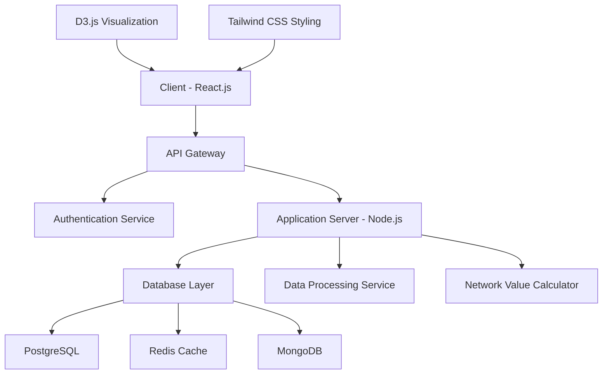

### Key Components

1. **Frontend (Client)**
   - React.js for building the user interface
   - Tailwind CSS for styling and responsive design
   - D3.js for interactive data visualizations

2. **Backend (Server)**
   - Node.js for server-side application logic
   - Express.js as the web application framework
   - RESTful API design for client-server communication

3. **Database Layer**
   - PostgreSQL for structured data storage
   - Redis for caching and session management
   - MongoDB for storing unstructured data (e.g., user posts)

4. **Authentication Service**
   - Phone number-based authentication system
   - JWT (JSON Web Tokens) for secure API access

5. **Data Processing Service**
   - Handles data aggregation and analysis
   - Calculates network values and generates insights

6. **Network Value Calculator**
   - Custom algorithm for quantifying user network value
   - Real-time updates based on user interactions and connections

### Core Features

1. User Authentication and Profile Management
2. Personalized Onboarding Process
3. Invite Management System
4. Network Value Calculation and Visualization
5. Industry-Specific Networking Feeds
6. Data Visualization and Analytics
7. Responsive Design across devices

### Technology Stack Summary

| Component | Technology |
|-----------|------------|
| Frontend Framework | React.js |
| Styling | Tailwind CSS |
| Data Visualization | D3.js |
| Backend Server | Node.js with Express.js |
| Primary Database | PostgreSQL |
| Caching Layer | Redis |
| Document Store | MongoDB |
| API Design | RESTful |
| Authentication | JWT |
| Version Control | Git |
| Deployment | Cloud-based (specific provider TBD) |

This system overview provides a high-level description of the Pollen8 platform, highlighting its key components, core features, and technology stack. The architecture is designed to be scalable, maintainable, and aligned with modern web development practices, ensuring a robust foundation for the innovative networking features of Pollen8.

# 5. SYSTEM ARCHITECTURE

## 5.1 PROGRAMMING LANGUAGES

The Pollen8 platform will utilize the following programming languages, chosen for their suitability to the project requirements, performance, and ecosystem support:

| Language | Purpose | Justification |
|----------|---------|---------------|
| JavaScript (ES6+) | Frontend development, Backend development | - Versatile language for both client and server-side development<br>- Large ecosystem with robust libraries and frameworks<br>- Excellent performance for web applications |
| TypeScript | Frontend and Backend type checking | - Adds static typing to JavaScript, enhancing code quality and maintainability<br>- Improves developer productivity with better tooling and IDE support |
| HTML5 | Frontend markup | - Latest standard for structuring web content<br>- Provides semantic elements for improved accessibility and SEO |
| CSS3 (with Tailwind CSS) | Frontend styling | - Modern styling capabilities<br>- Tailwind CSS enables rapid UI development with utility classes |
| SQL | Database queries | - Standard language for relational database operations<br>- Used for complex queries and data manipulation in PostgreSQL |

## 5.2 HIGH-LEVEL ARCHITECTURE DIAGRAM

The following diagram provides an overview of the Pollen8 system architecture:

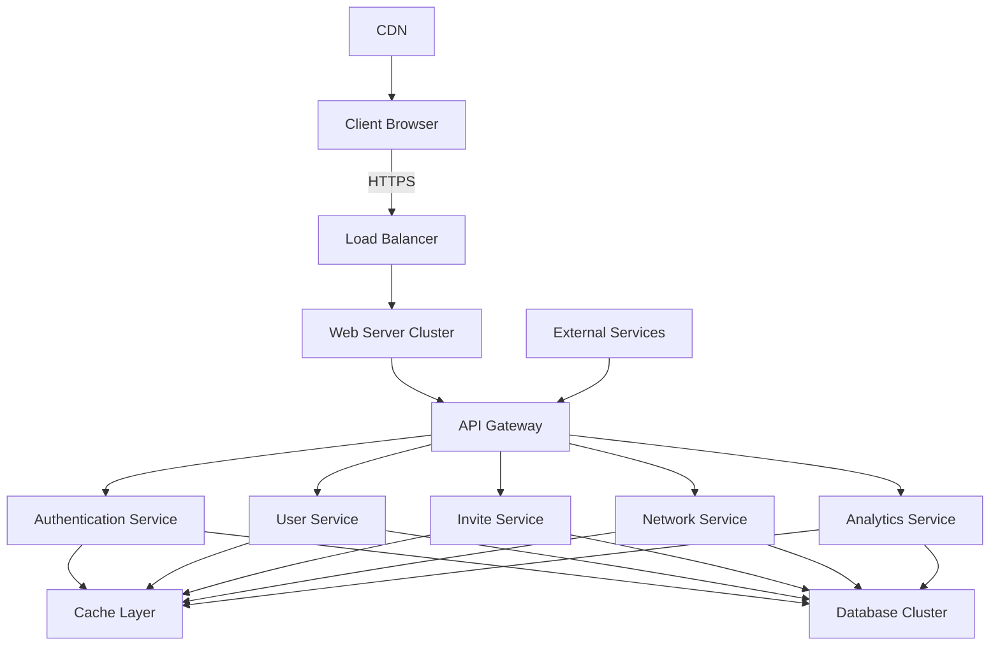

This architecture ensures scalability, maintainability, and separation of concerns within the Pollen8 platform.

## 5.3 COMPONENT DIAGRAMS

### Frontend Components

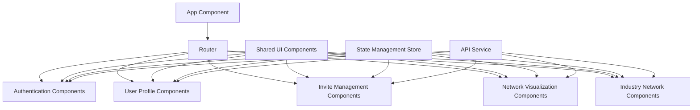

### Backend Components

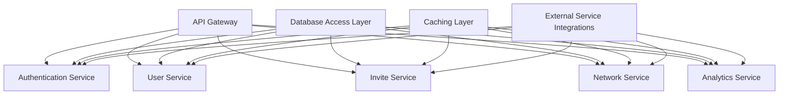

## 5.4 SEQUENCE DIAGRAMS

### User Authentication Flow

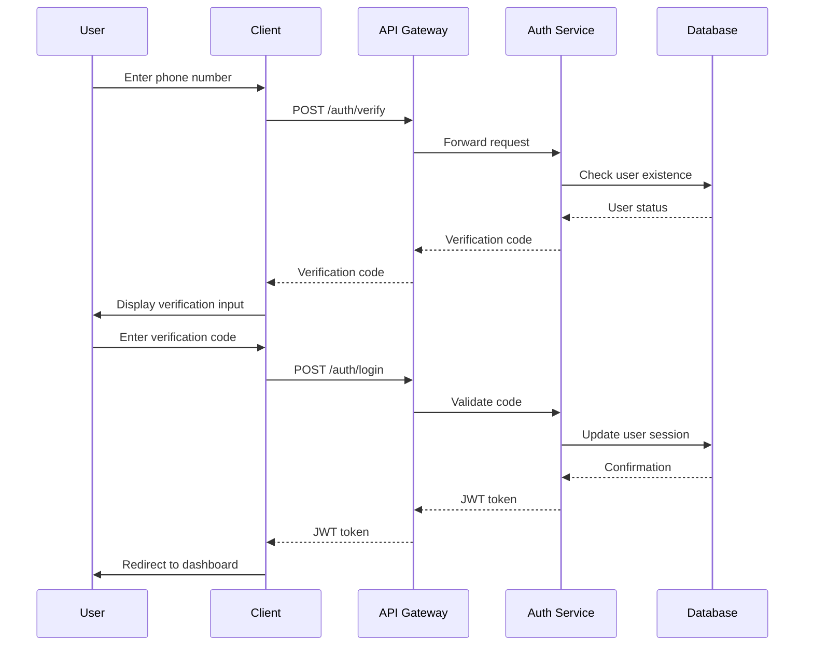

## 5.5 DATA-FLOW DIAGRAM

The following diagram illustrates how data flows through the Pollen8 system:

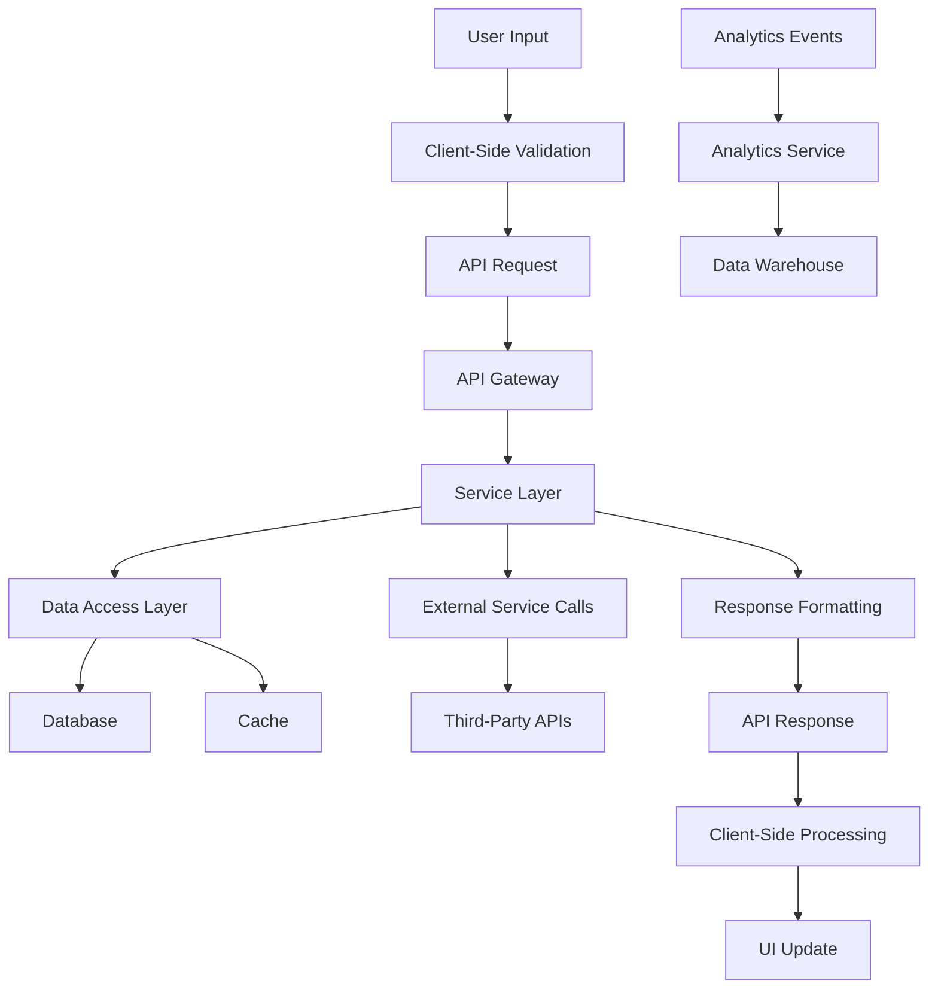

This data flow ensures efficient processing of user interactions, data storage, and retrieval within the Pollen8 platform. The architecture leverages caching and optimized data access patterns to minimize latency and enhance user experience.

The system architecture described above aligns with the previously specified technologies (React.js, Node.js, D3.js, Tailwind CSS) and provides a robust foundation for building the Pollen8 platform. It emphasizes scalability, maintainability, and performance, which are crucial for delivering a high-quality networking platform.

# 6. SYSTEM DESIGN

## 6.1 PROGRAMMING LANGUAGES

The Pollen8 platform will utilize the following programming languages, chosen for their suitability to the project requirements, performance, and ecosystem support:

| Language | Purpose | Justification |
|----------|---------|---------------|
| JavaScript (ES6+) | Frontend development, Backend development | - Versatile language for both client and server-side development<br>- Large ecosystem with robust libraries and frameworks<br>- Excellent performance for web applications |
| TypeScript | Frontend and Backend type checking | - Adds static typing to JavaScript, enhancing code quality and maintainability<br>- Improves developer productivity with better tooling and IDE support |
| HTML5 | Frontend markup | - Latest standard for structuring web content<br>- Provides semantic elements for improved accessibility and SEO |
| CSS3 (with Tailwind CSS) | Frontend styling | - Modern styling capabilities<br>- Tailwind CSS enables rapid UI development with utility classes |
| SQL | Database queries | - Standard language for relational database operations<br>- Used for complex queries and data manipulation in PostgreSQL |

## 6.2 DATABASE DESIGN

Pollen8 will use a combination of PostgreSQL for structured data and MongoDB for unstructured data. Redis will be used as a caching layer. The following diagram illustrates the high-level database design:

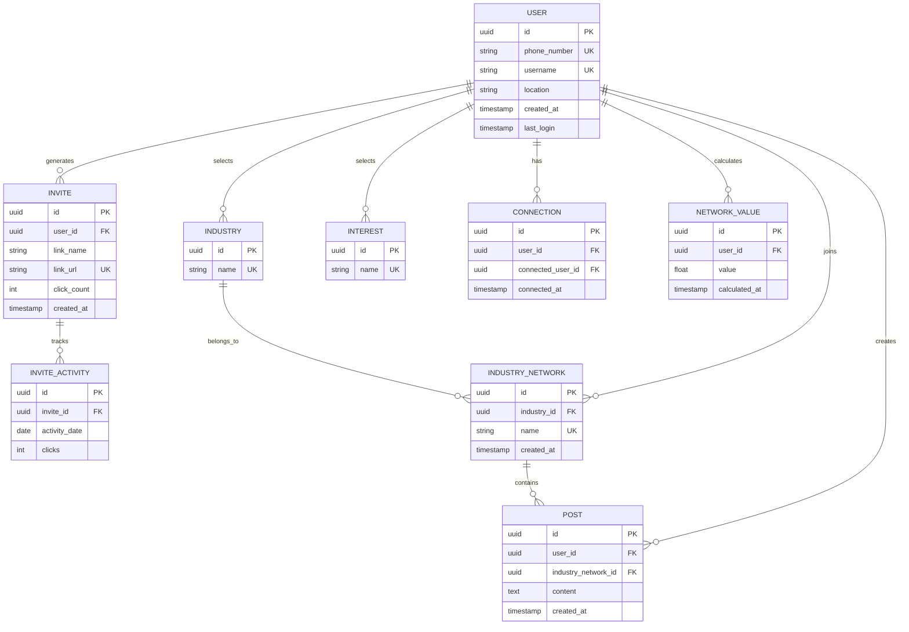

PostgreSQL will store structured data (USER, INVITE, INDUSTRY, INTEREST, CONNECTION, NETWORK_VALUE, INVITE_ACTIVITY, INDUSTRY_NETWORK), while MongoDB will store unstructured data (POST). Redis will cache frequently accessed data to improve performance.

## 6.3 API DESIGN

Pollen8 will use a RESTful API design for communication between the frontend and backend. The API will be versioned to ensure future compatibility. Here's an overview of the main API endpoints:

```mermaid
graph TD
    A[API v1] --> B[/auth]
    A --> C[/users]
    A --> D[/invites]
    A --> E[/industries]
    A --> F[/interests]
    A --> G[/connections]
    A --> H[/network-value]
    A --> I[/industry-networks]
    A --> J[/posts]

    B --> B1[POST /login]
    B --> B2[POST /verify]
    B --> B3[POST /logout]

    C --> C1[GET /profile]
    C --> C2[PUT /profile]

    D --> D1[POST /generate]
    D --> D2[GET /list]
    D --> D3[GET /:id/activity]

    G --> G1[POST /connect]
    G --> G2[GET /list]

    H --> H1[GET /calculate]

    I --> I1[POST /create]
    I --> I2[GET /list]
    I --> I3[GET /:id/posts]

    J --> J1[POST /create]
    J --> J2[GET /:id]
    J --> J3[PUT /:id]
    J --> J4[DELETE /:id]
```

All API endpoints will use JSON for request and response payloads, and will implement proper error handling and status codes.

## 6.4 USER INTERFACE DESIGN

The Pollen8 user interface will be built using React.js components and styled with Tailwind CSS. The design will follow a minimalist black-and-white aesthetic. Here's an overview of the main pages and their key components:

1. Welcome Page
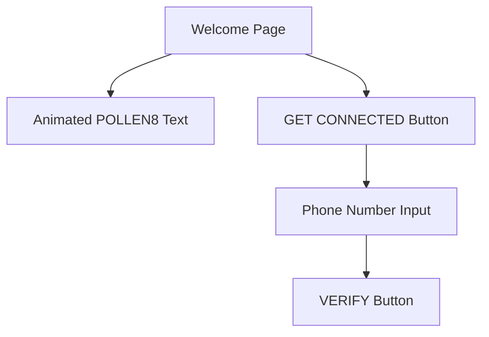

2. Onboarding Form
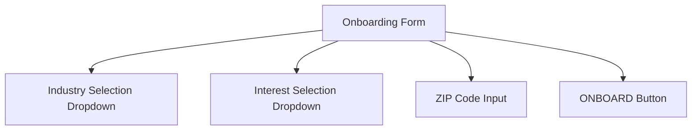

3. User Profile Page
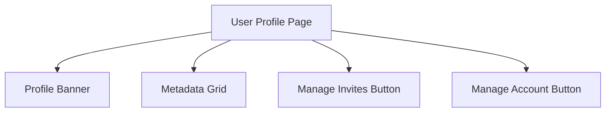

4. Invite Management Page
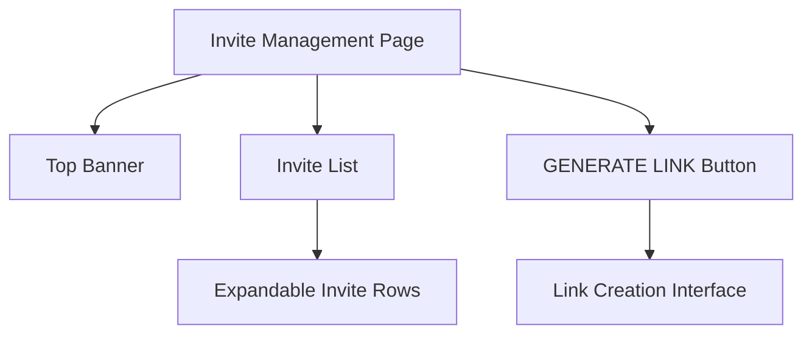

5. Account Page
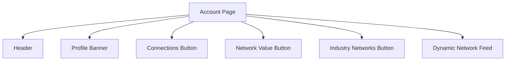

Each page will be responsive, adapting to different screen sizes while maintaining the black-and-white aesthetic. Interactive elements will feature smooth animations and transitions to enhance user experience. Data visualizations, such as network graphs and activity charts, will be implemented using D3.js to provide engaging and informative visual representations of user data.

This system design aligns with the previously specified technologies (React.js, Node.js, D3.js, Tailwind CSS, PostgreSQL, MongoDB, Redis) and provides a solid foundation for building the Pollen8 platform with a focus on performance, scalability, and user experience.

# 7. TECHNOLOGY STACK

## 7.1 PROGRAMMING LANGUAGES

The following programming languages will be used in the development of the Pollen8 platform:

| Language | Purpose | Justification |
|----------|---------|---------------|
| JavaScript (ES6+) | Frontend and Backend development | - Versatile language for both client and server-side development<br>- Large ecosystem with robust libraries and frameworks<br>- Excellent performance for web applications |
| TypeScript | Type checking for Frontend and Backend | - Adds static typing to JavaScript, enhancing code quality and maintainability<br>- Improves developer productivity with better tooling and IDE support |
| HTML5 | Frontend markup | - Latest standard for structuring web content<br>- Provides semantic elements for improved accessibility and SEO |
| CSS3 | Frontend styling | - Modern styling capabilities<br>- Used in conjunction with Tailwind CSS for rapid UI development |
| SQL | Database queries | - Standard language for relational database operations<br>- Used for complex queries and data manipulation in PostgreSQL |

## 7.2 FRAMEWORKS AND LIBRARIES

The Pollen8 platform will utilize the following frameworks and libraries:

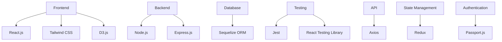

Justifications:
- React.js: Efficient component-based UI development with a large ecosystem
- Tailwind CSS: Rapid UI development with utility-first approach
- D3.js: Powerful library for creating interactive data visualizations
- Node.js: JavaScript runtime for server-side development, allowing code sharing between frontend and backend
- Express.js: Minimal and flexible web application framework for Node.js
- Sequelize ORM: Simplifies database operations and provides an abstraction layer
- Jest and React Testing Library: Comprehensive testing solutions for both frontend and backend
- Axios: Promise-based HTTP client for making API requests
- Redux: Predictable state management for complex applications
- Passport.js: Authentication middleware for Node.js with various strategies

## 7.3 DATABASES

Pollen8 will employ a multi-database approach to efficiently handle different types of data:

| Database | Type | Purpose |
|----------|------|---------|
| PostgreSQL | Relational | Primary database for structured data (user profiles, connections, invites) |
| Redis | In-memory key-value store | Caching layer for improved performance and session management |
| MongoDB | Document-oriented NoSQL | Storage for unstructured data (user posts, activity logs) |

This combination allows for:
- ACID compliance and complex queries with PostgreSQL
- High-performance caching and real-time data handling with Redis
- Flexibility in storing and retrieving unstructured data with MongoDB

## 7.4 THIRD-PARTY SERVICES

The following external services and APIs will be integrated into the Pollen8 platform:

1. Authentication Service:
   - Twilio: For phone number verification and SMS-based authentication

2. Email Service:
   - SendGrid: For transactional emails and notifications

3. Analytics:
   - Google Analytics: For user behavior tracking and website analytics
   - Mixpanel: For in-depth user engagement and funnel analysis

4. Cloud Services:
   - Amazon Web Services (AWS):
     - S3 for file storage
     - CloudFront for content delivery network (CDN)
     - EC2 for hosting application servers

5. Monitoring and Error Tracking:
   - New Relic: For application performance monitoring
   - Sentry: For real-time error tracking and debugging

6. Payment Processing (for future premium features):
   - Stripe: Secure and scalable payment processing

7. Mapping and Geolocation:
   - Mapbox: For location-based features and visualizations

8. Security:
   - Auth0: For advanced authentication and authorization features
   - Let's Encrypt: For free SSL/TLS certificates

This technology stack provides a robust and scalable foundation for the Pollen8 platform, leveraging modern tools and services to ensure high performance, security, and maintainability. The choices align with the previously specified requirements and the platform's focus on delivering a seamless, data-driven networking experience.

# 8. SECURITY CONSIDERATIONS

## 8.1 AUTHENTICATION AND AUTHORIZATION

Pollen8 implements a robust authentication and authorization system to ensure secure access to the platform and protect user data.

### Authentication

1. Phone Number-based Authentication:
   - Users register and log in using their phone numbers.
   - A one-time password (OTP) is sent via SMS for verification.

2. Multi-factor Authentication (MFA):
   - Optional MFA for enhanced account security.
   - Supports authenticator apps (e.g., Google Authenticator, Authy).

3. JSON Web Tokens (JWT):
   - Used for maintaining user sessions.
   - Short-lived access tokens and longer-lived refresh tokens.

4. Password-less Authentication:
   - Implements WebAuthn standard for biometric and hardware token authentication.

### Authorization

1. Role-Based Access Control (RBAC):
   - Defines user roles (e.g., regular user, admin, moderator).
   - Permissions are assigned to roles rather than individual users.

2. Attribute-Based Access Control (ABAC):
   - Fine-grained access control based on user attributes and resource properties.

3. OAuth 2.0 and OpenID Connect:
   - Used for third-party integrations and future mobile app authentication.

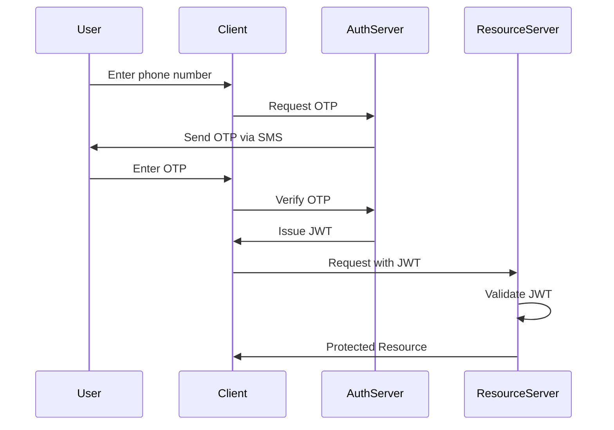

## 8.2 DATA SECURITY

Pollen8 prioritizes the security of user data through various measures:

1. Encryption:
   - Data at rest: AES-256 encryption for sensitive data in databases.
   - Data in transit: TLS 1.3 for all network communications.

2. Data Anonymization:
   - Personal Identifiable Information (PII) is anonymized for analytics and reporting.

3. Data Minimization:
   - Only essential data is collected and stored.
   - Regular data purging of unnecessary information.

4. Secure Key Management:
   - Hardware Security Modules (HSMs) for storing cryptographic keys.
   - Regular key rotation and access auditing.

5. Database Security:
   - Principle of least privilege for database access.
   - Regular security patching and updates.

6. Backup and Recovery:
   - Encrypted backups stored in geographically diverse locations.
   - Regular testing of data recovery procedures.

| Data Type | Encryption Method | Access Control |
|-----------|-------------------|-----------------|
| User Profiles | AES-256 | Role-based |
| Phone Numbers | Hashed and Salted | Restricted |
| Network Data | AES-256 | User-specific |
| Analytics Data | Anonymized | Aggregated |

## 8.3 SECURITY PROTOCOLS

Pollen8 adheres to industry-standard security protocols and best practices:

1. Secure Development Lifecycle (SDL):
   - Regular security training for developers.
   - Automated security testing in CI/CD pipeline.
   - Code reviews with security focus.

2. Vulnerability Management:
   - Regular vulnerability scans and penetration testing.
   - Bug bounty program for responsible disclosure.
   - Timely patching of identified vulnerabilities.

3. Incident Response Plan:
   - Documented procedures for handling security incidents.
   - Regular drills and updates to the incident response plan.

4. Compliance:
   - GDPR and CCPA compliance for data protection.
   - Regular security audits and assessments.

5. Network Security:
   - Web Application Firewall (WAF) to protect against common web attacks.
   - Intrusion Detection and Prevention Systems (IDS/IPS).
   - Regular network segmentation reviews.

6. Monitoring and Logging:
   - Centralized log management with SIEM integration.
   - Real-time alerting for suspicious activities.
   - Regular log analysis for security insights.

7. API Security:
   - API key management and rotation.
   - Rate limiting to prevent abuse.
   - Input validation and sanitization.

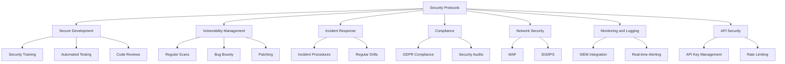

These security considerations align with the previously specified technologies (React.js, Node.js, D3.js, Tailwind CSS) and provide a comprehensive approach to securing the Pollen8 platform. By implementing these measures, Pollen8 aims to protect user data, maintain system integrity, and build trust with its user base.